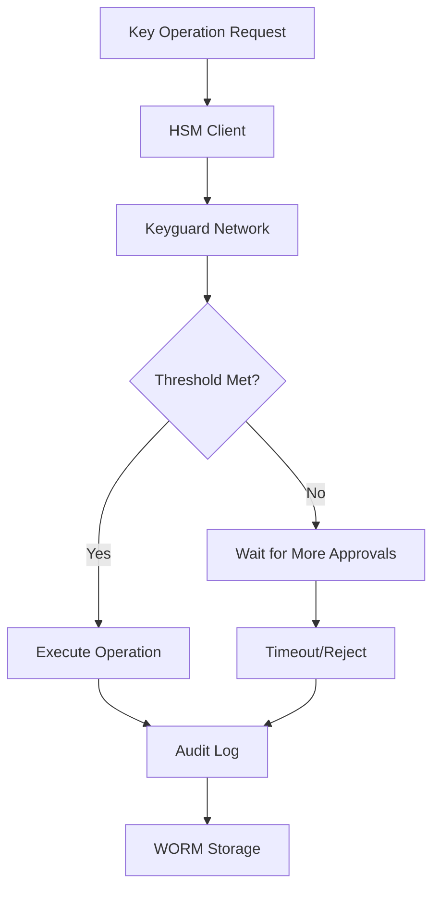
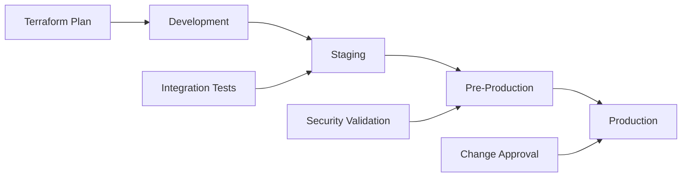

# Privix Blockchain Node - Security Operational Procedures

## 🔒 Overview

This document defines the security operational procedures for the Privix blockchain node infrastructure, implementing enterprise-grade security best practices as required by our audit team. All procedures are designed to ensure maximum security, compliance, and operational integrity.

## 📋 Table of Contents

1. [Separation of Duties & Multi-Party Approval](#separation-of-duties--multi-party-approval)
2. [Principle of Least Privilege](#principle-of-least-privilege)
3. [Threshold Key Management](#threshold-key-management)
4. [Immutable Audit Trails](#immutable-audit-trails)
5. [Infrastructure as Code](#infrastructure-as-code)
6. [Incident Response](#incident-response)
7. [Compliance & Monitoring](#compliance--monitoring)
8. [Emergency Procedures](#emergency-procedures)

---

## 1. Separation of Duties & Multi-Party Approval

### 1.1 Code Review Requirements

#### Critical Path Reviews
All changes to the following components require **minimum 3 reviewers** including security team and lead architect:

- `/consensus/` - Consensus algorithm and validation logic
- `/crypto/` - Cryptographic functions and key management
- `/secrets/` - Secret management and HSM integration
- `/network/` - Networking and P2P communication
- `/validators/` - Validator set management

#### Standard Path Reviews
All other code changes require **minimum 2 reviewers** including security team:

- `/command/` - CLI interfaces and configuration
- `/server/` - Server implementation and APIs
- `/blockchain/` - Blockchain storage and state management
- `/state/` - State execution and transition logic

#### Deployment Reviews
Production deployments require **minimum 2 approvals** from:

- DevOps team member
- Security team member
- Optional: Lead architect (for critical changes)

### 1.2 Branch Protection Rules

#### Main Branch Protection
```yaml
Protection Rules:
- Require pull request reviews before merging: ✅
- Required approving review count: 2
- Dismiss stale reviews when new commits are pushed: ✅
- Require review from code owners: ✅
- Require status checks to pass before merging: ✅
- Require branches to be up to date before merging: ✅
- Require conversation resolution before merging: ✅
- Restrict pushes that create files: ✅
- Required status checks:
  - continuous-integration
  - security-scan
  - consensus-tests
  - crypto-tests
  - network-tests
  - build-verification
  - commit-signature-verification
```

#### Production Branch Protection
```yaml
Additional Protection Rules:
- Required approving review count: 3
- Enforce admins: ✅
- Allow force pushes: ❌
- Allow deletions: ❌
- Required linear history: ✅
- Required signed commits: ✅
```

### 1.3 Approval Workflows

#### Standard Change Approval
1. **Developer** creates pull request
2. **Automated Security Scans** must pass
3. **Code Owner Review** (domain expert)
4. **Security Team Review** (security implications)
5. **Final Approval** (senior team member)
6. **Automated Deployment** (if all checks pass)

#### Critical Change Approval
1. **Developer** creates pull request with detailed security impact analysis
2. **Comprehensive Security Scans** including penetration testing
3. **Lead Architect Review** (architecture and design)
4. **Security Team Review** (detailed security analysis)
5. **Compliance Review** (regulatory implications)
6. **Management Approval** (for high-risk changes)
7. **Staged Deployment** with rollback plan

### 1.4 Emergency Override Procedures

#### Break-Glass Access
Only for **P0 security incidents** or **critical production failures**:

1. **Security Incident Manager** initiates break-glass procedure
2. **Two-person authorization** required (Security + Engineering Lead)
3. **Detailed justification** logged in audit system
4. **Time-limited access** (maximum 4 hours)
5. **Full audit trail** of all actions taken
6. **Post-incident review** within 24 hours

---

## 2. Principle of Least Privilege

### 2.1 Role-Based Access Control (RBAC)

#### Developer Roles
```yaml
Standard Developer:
  Repository Access: Read/Write (non-main branches)
  CI/CD Access: Read-only
  Production Access: None
  Secret Access: Development secrets only

Senior Developer:
  Repository Access: Read/Write (including PRs to main)
  CI/CD Access: Read/Write (staging)
  Production Access: Read-only monitoring
  Secret Access: Staging secrets

Lead Developer:
  Repository Access: Full (including main branch approval)
  CI/CD Access: Read/Write (staging + limited production)
  Production Access: Limited (emergency only)
  Secret Access: Staging + emergency production
```

#### Operations Roles
```yaml
DevOps Engineer:
  Repository Access: Read + CI/CD configuration
  CI/CD Access: Full (all environments)
  Production Access: Deploy + monitor
  Secret Access: Infrastructure secrets

Site Reliability Engineer:
  Repository Access: Read + monitoring configuration
  CI/CD Access: Read + monitoring
  Production Access: Monitor + incident response
  Secret Access: Monitoring secrets

Security Engineer:
  Repository Access: Full (security review)
  CI/CD Access: Security configuration
  Production Access: Security monitoring + audit
  Secret Access: Security + audit secrets
```

### 2.2 Service Account Management

#### CI/CD Service Accounts
```yaml
GitHub Actions (Build):
  AWS Permissions:
    - ECR: Read/Write (specific repositories)
    - S3: Write (build artifacts bucket)
    - CloudWatch: Write (logs only)
  Duration: Session-based (1 hour max)
  Conditions: IP restriction + time-based

GitHub Actions (Deploy Staging):
  AWS Permissions:
    - ECS: Update service (staging cluster only)
    - ALB: Update target groups (staging only)
    - CloudFormation: Deploy (staging stacks only)
  Duration: Session-based (2 hours max)
  Conditions: IP + branch restrictions

GitHub Actions (Deploy Production):
  AWS Permissions:
    - ECS: Update service (production cluster only)
    - ALB: Update target groups (production only)
    - CloudFormation: Deploy (production stacks only)
  Duration: Session-based (1 hour max)
  Conditions: IP + manual approval + time window
```

#### Node Service Accounts
```yaml
Privix Node (Production):
  AWS Permissions:
    - KMS: Decrypt (node-specific keys only)
    - Secrets Manager: GetSecretValue (node secrets only)
    - S3: Read/Write (node data bucket specific prefix)
    - CloudWatch: PutMetricData + PutLogEvents
  Conditions: Instance-based + time restrictions

Monitoring Service:
  AWS Permissions:
    - CloudWatch: Read metrics + logs
    - EC2: DescribeInstances (monitoring tags only)
  Conditions: VPC + time restrictions
```

### 2.3 Secret Rotation Policies

#### Automatic Rotation
- **Database passwords**: Every 30 days
- **API keys**: Every 60 days
- **Service tokens**: Every 90 days
- **Encryption keys**: Every 365 days (with backward compatibility)

#### Manual Rotation Triggers
- **Security incident**: Immediate
- **Employee departure**: Within 24 hours
- **Suspected compromise**: Within 4 hours
- **Audit finding**: Within 7 days

---

## 3. Threshold Key Management

### 3.1 Hardware Security Module (HSM) Integration

#### HSM Configuration
```yaml
Primary HSM:
  Type: AWS CloudHSM
  Cluster: Multi-AZ (3 HSMs minimum)
  Backup: Cross-region replication
  Access: FIPS 140-2 Level 3

Secondary HSM:
  Type: Azure Dedicated HSM
  Configuration: Disaster recovery
  Sync: Daily backup from primary
  Access: Emergency failover only
```

#### Key Hierarchy
```
Root CA Key (HSM)
├── Intermediate CA Key (HSM)
│   ├── Validator Signing Keys (HSM)
│   ├── Network Identity Keys (HSM)
│   └── TLS Certificate Keys (HSM)
└── Audit Signing Key (HSM)
    ├── Build Signing Keys (HSM)
    └── Release Signing Keys (HSM)
```

### 3.2 Multi-Signature Requirements

#### Validator Key Operations
- **Key Generation**: 3-of-5 signature threshold
- **Key Rotation**: 3-of-5 signature threshold
- **Signing Authorization**: 2-of-3 signature threshold
- **Key Export** (emergency): 4-of-5 signature threshold

#### Infrastructure Key Operations
- **TLS Certificate Generation**: 2-of-3 signature threshold
- **Database Encryption Keys**: 2-of-3 signature threshold
- **Backup Encryption Keys**: 3-of-5 signature threshold

#### Build and Release Signing
- **Development Builds**: 1-of-3 signature threshold
- **Staging Builds**: 2-of-3 signature threshold
- **Production Builds**: 3-of-5 signature threshold
- **Emergency Releases**: 2-of-3 signature threshold + management approval

### 3.3 Keyguard Network

#### Keyguard Node Setup
```yaml
Keyguard 1:
  Location: AWS us-east-1
  Operator: Security Team Lead
  Backup Operator: Lead Architect
  
Keyguard 2:
  Location: AWS us-west-2
  Operator: DevOps Lead
  Backup Operator: Senior Developer
  
Keyguard 3:
  Location: Azure East US
  Operator: External Security Auditor
  Backup Operator: CTO
  
Keyguard 4:
  Location: GCP us-central1
  Operator: Independent Board Member
  Backup Operator: Security Consultant
  
Keyguard 5:
  Location: On-premise (Cold storage)
  Operator: Physical Security Officer
  Backup Operator: Facilities Manager
```

#### Approval Process Flow


---

## 4. Immutable Audit Trails

### 4.1 WORM Storage Implementation

#### AWS S3 Object Lock Configuration
```yaml
Bucket Configuration:
  Object Lock: Enabled
  Mode: Compliance
  Retention: 7 years
  Legal Hold: Enabled for incidents
  
Lifecycle Policy:
  Transition to IA: 30 days
  Transition to Glacier: 90 days
  Transition to Deep Archive: 365 days
  
Access Control:
  Read: Audit team + compliance
  Write: System audit logger only
  Delete: Prohibited (object lock)
```

#### Audit Log Structure
```json
{
  "version": "1.0",
  "timestamp": "2024-01-20T15:30:45.123Z",
  "event_id": "audit-1705758645123-7891",
  "event_type": "consensus_block_validation",
  "actor": {
    "type": "system",
    "node_id": "privix-node-prod-001",
    "ip_address": "10.0.1.15",
    "session_id": "sess_abc123def456"
  },
  "resource": {
    "type": "blockchain_block",
    "id": "block_12345",
    "hash": "0xabcd1234...",
    "height": 12345
  },
  "action": "validate_block",
  "result": "success",
  "details": {
    "validation_time_ms": 45,
    "transaction_count": 23,
    "gas_used": 8500000,
    "validator_signature": "0x9876543210..."
  },
  "chain_hash": "sha256:prev_hash_link",
  "signature": "ecdsa:audit_signature",
  "compliance": {
    "retention_date": "2031-01-20T15:30:45.123Z",
    "classification": "internal",
    "legal_hold": false
  }
}
```

### 4.2 Commit Signing Enforcement

#### GPG Key Management
```bash
# Generate GPG key for commit signing
gpg --full-generate-key --expert

# Configure Git for signing
git config --global commit.gpgsign true
git config --global user.signingkey YOUR_GPG_KEY_ID

# Configure GPG agent
echo "default-cache-ttl 28800" >> ~/.gnupg/gpg-agent.conf
echo "max-cache-ttl 86400" >> ~/.gnupg/gpg-agent.conf
```

#### Authorized Signing Keys
```yaml
Security Team:
  - John Smith: 4096R/ABCD1234 (expires: 2025-12-31)
  - Jane Doe: 4096R/EFGH5678 (expires: 2025-12-31)
  
Development Team:
  - Alice Johnson: 4096R/IJKL9012 (expires: 2025-06-30)
  - Bob Wilson: 4096R/MNOP3456 (expires: 2025-06-30)
  
External Auditors:
  - SecurityCorp: 4096R/QRST7890 (expires: 2024-12-31)
```

#### Signature Verification Pipeline
```yaml
Verification Steps:
  1. Extract commit signature
  2. Verify signature cryptographically
  3. Check signer against authorized keyring
  4. Validate key expiration and revocation
  5. Confirm signer authorization for changed paths
  6. Log verification result to audit trail
  7. Block merge if verification fails
```

### 4.3 Audit Event Categories

#### Security Events
- Authentication attempts (success/failure)
- Authorization decisions
- Key generation/rotation/usage
- Certificate operations
- Security policy changes

#### Operational Events
- System configuration changes
- Software deployments
- Infrastructure modifications
- Network topology changes
- Performance threshold breaches

#### Consensus Events
- Block proposals and validations
- Validator set changes
- Fork detection and resolution
- Consensus failures and recoveries
- Network partition events

#### Administrative Events
- User account changes
- Permission modifications
- Policy updates
- Emergency procedures
- Compliance activities

---

## 5. Infrastructure as Code

### 5.1 Terraform State Management

#### Remote State Configuration
```hcl
terraform {
  backend "s3" {
    bucket         = "privix-terraform-state-prod"
    key            = "infrastructure/privix-node/terraform.tfstate"
    region         = "us-east-1"
    encrypt        = true
    kms_key_id     = "arn:aws:kms:us-east-1:ACCOUNT:key/KEY-ID"
    dynamodb_table = "privix-terraform-locks"
    
    # Workspace isolation
    workspace_key_prefix = "workspaces"
  }
}
```

#### State Locking and Versioning
```yaml
DynamoDB Table (privix-terraform-locks):
  Partition Key: LockID (String)
  Attributes:
    - Lock holder
    - Timestamp
    - Operation type
  
S3 Bucket Versioning:
  Status: Enabled
  MFA Delete: Required
  Lifecycle: 90 days retention
```

### 5.2 Drift Detection

#### AWS Config Rules
```yaml
Drift Detection Rules:
  - ec2-instance-detailed-monitoring-enabled
  - ec2-security-group-attached-to-eni
  - s3-bucket-public-write-prohibited
  - kms-cmk-not-scheduled-for-deletion
  - iam-role-managed-policy-check
  
Custom Rules:
  - privix-node-configuration-compliance
  - hsm-key-rotation-compliance
  - audit-log-retention-compliance
```

#### Automated Remediation
```yaml
Remediation Actions:
  Non-Compliant Security Group:
    Action: Remove non-compliant rules
    Approval: Automatic (low risk)
    Notification: Security team
    
  Unencrypted Storage:
    Action: Enable encryption
    Approval: Manual (medium risk)
    Notification: Security + DevOps
    
  Missing Backup:
    Action: Enable backup
    Approval: Automatic (low risk)
    Notification: DevOps team
    
  Unauthorized Change:
    Action: Revert change
    Approval: Manual (high risk)
    Notification: Security + Management
```

### 5.3 Infrastructure Versioning

#### Environment Promotion


#### Rollback Procedures
```yaml
Rollback Triggers:
  - Failed health checks (automatic)
  - Security vulnerability detected (automatic)
  - Performance degradation (manual)
  - Compliance violation (manual)
  
Rollback Process:
  1. Stop traffic to affected resources
  2. Revert to last known good state
  3. Verify system stability
  4. Restore traffic gradually
  5. Conduct post-incident review
```

---

## 6. Incident Response

### 6.1 Security Incident Classification

#### P0 - Critical Security Incident
**Examples:**
- Active breach or unauthorized access
- Validator key compromise
- Consensus manipulation attack
- Data exfiltration

**Response Time:** 15 minutes
**Escalation:** Immediate to CISO and CEO
**Communication:** All stakeholders + external parties

#### P1 - High Security Incident
**Examples:**
- Suspicious network activity
- Failed authentication attempts (brute force)
- Unauthorized configuration changes
- Potential insider threat

**Response Time:** 1 hour
**Escalation:** Security team lead
**Communication:** Security and engineering teams

#### P2 - Medium Security Incident
**Examples:**
- Compliance violation detected
- Non-critical vulnerability discovered
- Audit log anomaly
- Policy violation

**Response Time:** 4 hours
**Escalation:** Security engineer
**Communication:** Relevant team members

#### P3 - Low Security Incident
**Examples:**
- Failed backup verification
- Certificate near expiration
- Log volume anomaly
- User access request

**Response Time:** 24 hours
**Escalation:** Standard queue
**Communication:** Team lead

### 6.2 Incident Response Procedures

#### Initial Response (First 15 minutes)
1. **Incident Detection**
   - Automated alerts trigger
   - Security monitoring identifies anomaly
   - Team member reports suspicious activity

2. **Initial Assessment**
   - Classify incident severity
   - Identify affected systems
   - Determine immediate containment needs

3. **Immediate Actions**
   - Contain the threat (isolate systems if needed)
   - Preserve evidence (snapshot states, logs)
   - Notify incident response team

#### Investigation Phase (First 4 hours)
1. **Evidence Collection**
   - Capture system snapshots
   - Export relevant audit logs
   - Document timeline of events
   - Interview relevant personnel

2. **Impact Assessment**
   - Identify compromised data/systems
   - Assess financial impact
   - Determine compliance implications
   - Evaluate reputation damage

3. **Root Cause Analysis**
   - Technical analysis of exploit
   - Process failure identification
   - Human factor assessment
   - Environmental conditions

#### Recovery Phase (4-24 hours)
1. **System Restoration**
   - Restore from clean backups
   - Rebuild compromised systems
   - Update security controls
   - Verify system integrity

2. **Security Hardening**
   - Patch identified vulnerabilities
   - Update security policies
   - Enhance monitoring rules
   - Conduct security validation

3. **Monitoring Enhancement**
   - Deploy additional detection rules
   - Increase logging verbosity
   - Enhance alerting thresholds
   - Implement new controls

#### Post-Incident Activities (1-7 days)
1. **Documentation**
   - Complete incident report
   - Document lessons learned
   - Update procedures
   - Create improvement plan

2. **Stakeholder Communication**
   - Internal stakeholder briefing
   - Customer notification (if required)
   - Regulatory reporting
   - Public disclosure (if required)

3. **Process Improvement**
   - Update incident response procedures
   - Enhance detection capabilities
   - Strengthen preventive controls
   - Conduct team training

### 6.3 Communication Templates

#### P0 Incident Notification
```
SUBJECT: [P0 SECURITY INCIDENT] - Immediate Action Required

INCIDENT ID: SEC-2024-0001
DETECTION TIME: 2024-01-20 15:30 UTC
INCIDENT TYPE: [Brief description]

IMMEDIATE IMPACT:
- [System/service affected]
- [Data/users impacted]
- [Business operations status]

CURRENT STATUS:
- [Containment actions taken]
- [Investigation progress]
- [ETA for resolution]

NEXT STEPS:
- [Immediate actions planned]
- [Resources required]
- [Communication schedule]

INCIDENT COMMANDER: [Name, Contact]
```

---

## 7. Compliance & Monitoring

### 7.1 Compliance Frameworks

#### SOC 2 Type II Compliance
**Controls Implemented:**
- CC1: Control Environment
- CC2: Communication and Information
- CC3: Risk Assessment
- CC4: Monitoring Activities
- CC5: Control Activities
- CC6: Logical and Physical Access Controls
- CC7: System Operations
- CC8: Change Management
- CC9: Risk Mitigation

**Evidence Collection:**
- Automated control testing
- Quarterly compliance reviews
- Annual third-party audit
- Continuous monitoring reports

#### ISO 27001 Compliance
**Control Families:**
- A.5: Information Security Policies
- A.6: Organization of Information Security
- A.8: Asset Management
- A.9: Access Control
- A.10: Cryptography
- A.12: Operations Security
- A.13: Communications Security
- A.14: System Acquisition
- A.16: Information Security Incident Management
- A.18: Compliance

### 7.2 Monitoring and Alerting

#### Security Monitoring
```yaml
Critical Alerts (Immediate):
  - Multiple failed authentication attempts
  - Privilege escalation detected
  - Unauthorized network connections
  - Data exfiltration patterns
  - Consensus algorithm anomalies

High Priority Alerts (15 minutes):
  - Certificate expiration warnings
  - Backup failure notifications
  - Performance threshold breaches
  - Compliance violation detected
  - Audit log tampering attempts

Medium Priority Alerts (1 hour):
  - Configuration drift detected
  - Resource utilization warnings
  - Failed scheduled tasks
  - Network latency increases
  - Disk space warnings

Low Priority Alerts (4 hours):
  - Maintenance reminders
  - Capacity planning notifications
  - Documentation updates needed
  - Training requirements
  - Policy review reminders
```

#### Monitoring Dashboard
```yaml
Real-time Metrics:
  Security:
    - Active threat indicators
    - Failed authentication rate
    - Network anomaly score
    - Vulnerability scan results
    
  Operations:
    - System availability
    - Response time percentiles
    - Error rate trends
    - Resource utilization
    
  Compliance:
    - Control effectiveness score
    - Audit finding status
    - Policy compliance rate
    - Training completion rate
```

### 7.3 Audit and Assessment Schedule

#### Internal Audits
```yaml
Monthly:
  - Access review and cleanup
  - Security configuration validation
  - Backup verification testing
  - Incident response testing

Quarterly:
  - Vulnerability assessment
  - Penetration testing
  - Compliance control testing
  - Risk assessment update

Annually:
  - Third-party security audit
  - Business continuity testing
  - Policy and procedure review
  - Staff security training
```

#### External Assessments
```yaml
Security Assessments:
  Provider: Independent security firm
  Frequency: Quarterly
  Scope: Full infrastructure and applications
  
Penetration Testing:
  Provider: Certified ethical hackers
  Frequency: Bi-annually
  Scope: External and internal testing
  
Compliance Audits:
  Provider: Certified public accountant
  Frequency: Annually
  Scope: SOC 2 Type II examination
```

---

## 8. Emergency Procedures

### 8.1 Emergency Contacts

#### Primary Response Team
```yaml
Incident Commander:
  Name: John Smith
  Role: CISO
  Phone: +1-555-0101
  Email: john.smith@privix.ai
  Backup: Jane Doe (CTO)

Security Lead:
  Name: Alice Johnson
  Role: Senior Security Engineer
  Phone: +1-555-0102
  Email: alice.johnson@privix.ai
  Backup: Bob Wilson

Engineering Lead:
  Name: Carlos Rodriguez
  Role: Lead DevOps Engineer
  Phone: +1-555-0103
  Email: carlos.rodriguez@privix.ai
  Backup: Diana Chen

Communications Lead:
  Name: Elena Vasquez
  Role: Head of Communications
  Phone: +1-555-0104
  Email: elena.vasquez@privix.ai
  Backup: Frank Miller
```

#### External Contacts
```yaml
Legal Counsel:
  Firm: SecurityLegal LLP
  Contact: Partner Sarah Johnson
  Phone: +1-555-0201
  Email: emergency@securitylegal.com

Incident Response:
  Firm: CyberSec Response
  Contact: 24/7 Hotline
  Phone: +1-555-0301
  Email: emergency@cybersecresponse.com

Cloud Provider:
  Provider: AWS Premium Support
  Contact: TAM (Technical Account Manager)
  Phone: +1-555-0401
  Email: aws-tam@privix.ai
```

### 8.2 Emergency Response Procedures

#### Validator Key Compromise
```yaml
Immediate Actions (0-15 minutes):
  1. Isolate affected validator nodes
  2. Revoke compromised keys from HSM
  3. Notify other validators in network
  4. Preserve forensic evidence
  5. Initiate incident response team

Short-term Actions (15 minutes - 4 hours):
  1. Generate new validator keys using threshold procedure
  2. Update validator set configuration
  3. Restart nodes with new keys
  4. Monitor network for anomalies
  5. Communicate with network participants

Long-term Actions (4 hours - 7 days):
  1. Complete forensic investigation
  2. Identify root cause of compromise
  3. Implement additional security controls
  4. Update key management procedures
  5. Conduct post-incident review
```

#### Network Partition
```yaml
Detection Criteria:
  - Loss of connectivity to >50% of validators
  - Block production stopped for >5 minutes
  - Consensus messages not propagating
  - Network split detected by monitoring

Response Actions:
  1. Assess network topology and connectivity
  2. Identify partition boundaries
  3. Determine which partition has majority
  4. Coordinate with other operators
  5. Implement partition resolution protocol
  6. Monitor for successful reunion
  7. Validate chain consistency
```

#### Critical Infrastructure Failure
```yaml
AWS Region Failure:
  1. Activate disaster recovery procedures
  2. Failover to secondary region
  3. Redirect traffic using DNS
  4. Verify data consistency
  5. Monitor application performance

HSM Failure:
  1. Activate backup HSM
  2. Verify key accessibility
  3. Test cryptographic operations
  4. Notify key management stakeholders
  5. Plan for primary HSM restoration

Database Corruption:
  1. Stop all write operations
  2. Assess corruption extent
  3. Restore from clean backup
  4. Verify data integrity
  5. Resume operations gradually
```

### 8.3 Business Continuity

#### Recovery Time Objectives (RTO)
```yaml
Critical Systems:
  Validator Nodes: 30 minutes
  HSM Services: 15 minutes
  Network Infrastructure: 45 minutes
  Monitoring Systems: 60 minutes

Important Systems:
  API Endpoints: 2 hours
  Documentation: 4 hours
  Development Tools: 8 hours
  Administrative Systems: 24 hours
```

#### Recovery Point Objectives (RPO)
```yaml
Data Types:
  Blockchain Data: 0 minutes (real-time replication)
  Configuration Data: 15 minutes
  Audit Logs: 5 minutes
  Application Data: 30 minutes
  Backup Data: 4 hours
```

#### Disaster Recovery Sites
```yaml
Primary Site:
  Location: AWS us-east-1
  Capacity: 100% production load
  Status: Active

Secondary Site:
  Location: AWS us-west-2
  Capacity: 100% production load
  Status: Warm standby

Tertiary Site:
  Location: Azure East US
  Capacity: 50% production load
  Status: Cold standby
```

---

## 📞 Emergency Hotline

**24/7 Security Incident Hotline: +1-555-SECURITY (+1-555-732-8748)**

**Email: security-emergency@privix.ai**

**Slack: #security-emergency**

---

## 📝 Document Control

| Version | Date | Author | Changes |
|---------|------|--------|---------|
| 1.0 | 2024-01-20 | Security Team | Initial version |
| 1.1 | 2024-01-25 | DevOps Team | Added infrastructure procedures |
| 1.2 | 2024-01-30 | Compliance Team | Enhanced audit requirements |

**Next Review Date:** 2024-04-20

**Document Owner:** Chief Information Security Officer (CISO)

**Approval:** Chief Technology Officer (CTO), Chief Executive Officer (CEO)

---

*This document contains confidential and proprietary information. Distribution is restricted to authorized personnel only.* 